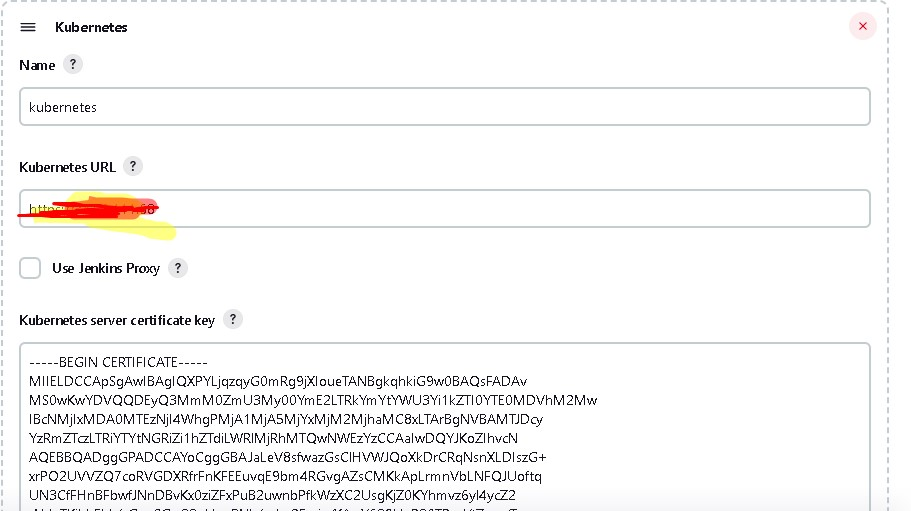
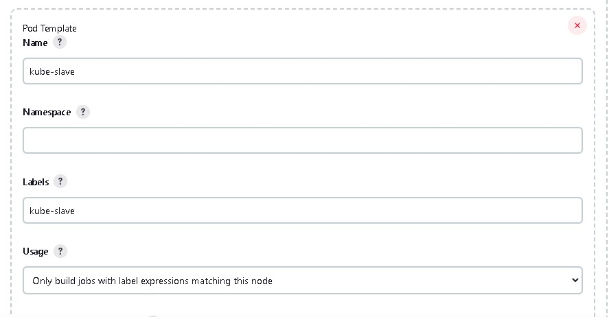
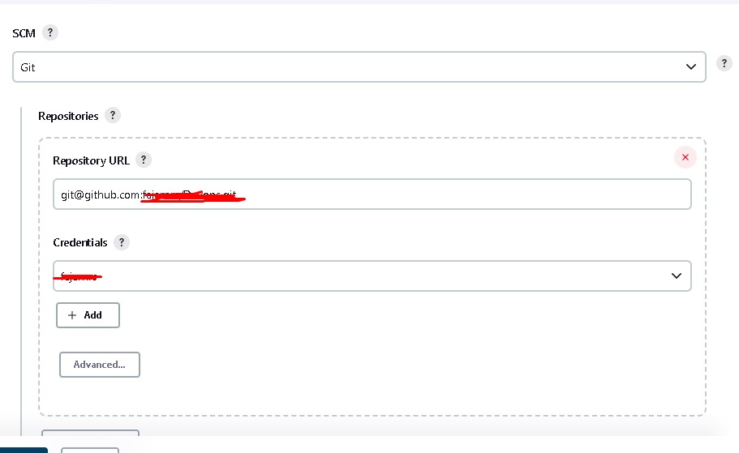

# Devops Test New Employment

This is for Test Number 2 to deploy SimpleService and Influxdb

<h2>Plugin Must Install Before Start and set credentials</h2>

1. Jenkins
   <p> Install Plugin kubernetes, kubernetes CLI, Google Kubernetes Engine, Kubernetes Credential Plugin and make sure git plugin installed</p>
   <p>next step create credential in jenkins like credential for login to github repo, docker repo and google kubernetes</p>

2. Docker
    <p> After Install Docker Engine in Linux, Please Usermod first for running jenkins to docker</p>
    
    ```
    usermod -aG docker jenkins
    ```
    <p>Restart Docker after usermod<p>
3. kubectl
  <p> Apply First for Ingress and Influxdb to your kubernetes because this yaml not include in CI/CD.</p>
4. google kubernetes engine
   <p>Create Kubernetes Cluster dan import Service Account key in AIM menu</p>

<h2>Jenkins Prepare CI/CD</h2>

1. Setting Node Cloud for Connect to Google Kubernetes Engine 
```
Manage Jenkins -> Manage Nodes and Clouds -> Manage Clouds
```
<br>
2. Choose Kubernetes in 'kubernetes' you can assign kubernetes cluster IP from your GKE(Google Kubernetes Engine) Cluster and get Credential key sam place under IP kubernetes Cluster
             
3. For the next Step we must add jenkins_url ```http://hostname:port``` and choose websocket for connect to agent<br>
4. in the menu kubernetes have pod template this menu use for create pod agent kubernetes to support Deployment to GKE and give label for intialitaion agent if we want to use this agent
             
5. for test the agent we can make freestyle project and choose Restrict where this project and input the label of agent we made for example ```kube-slave``` and choose build step execute shell for test command in the agent if success we can go to next step for create CI/CD pipeline jenkins
6. Create new Item and select the pipeline Project after that scroll and until pipeline category and choose pipeline script from SCM for running jenkinsfile for SCM select git and paste repository where we use for CI/CD and select credential of  github we add in the first after install plugin after that save and build
                
7. after that try to build the job jenkins we made for CI/CD for SimpleService

<hr />
<h1>Monitoring Using Influxdb and Grafana

<h3>Software must install in server or windows</h3>

1. helm chart
   <p>For the install you can access to helm chart website <a href 
2. kubectl
